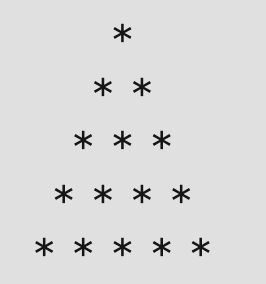
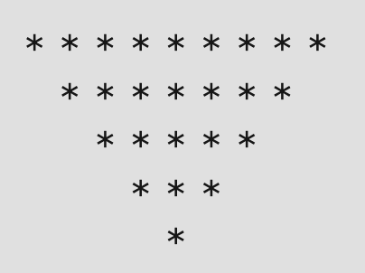
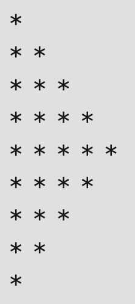
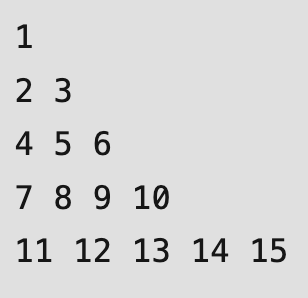
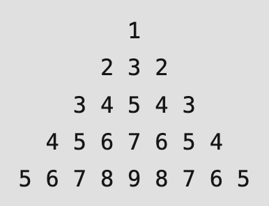

# C++ Programming For Science - Assignment 2

This template repository is the starter project for C++ Programming For Science Assignment 2. Written in C++, and tested with CMake/Catch2.

### Question(s)

1. Write a C++ function to print the following triangle pattern:

2. Write a C++ function to print the following inverted triangle pattern:

3. Write a C++ function to print the following half diamond pattern:

4. Write a C++ function to print the following numbers pattern without reassigning pattern:

5. Write a C++ function to print the following palindrome triangle pattern:

### Setup Command

`make clean`

### Run Command

`make test`